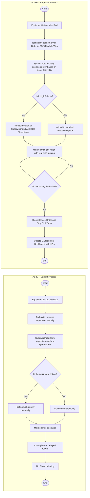

# SGOS – Business Analysis Case

Business Analysis project modeling AS-IS and TO-BE processes, defining requirements, business rules, and KPIs for a Service Management System.

---

## Author
Henrique Santos da Silva  
**Date:** February 2026  
**Version:** 2.0  

---

## Introduction

This project presents a Business Analysis case for a Service Management System (SGOS), aiming to optimize operational processes, reduce rework, and improve efficiency through structured workflow modeling and SLA monitoring.

---

## Problem Statement

The current service order process lacks SLA control, structured prioritization, and proper execution records. This leads to operational inefficiencies, inconsistent task management, and limited performance visibility for leadership.

---

## Stakeholders

- **Maintenance Technicians** – Execution and operational activities.
- **Supervisor** – Task distribution and SLA control.
- **Operational Manager** – Cost reduction and performance monitoring.
- **Board of Directors** – Strategic indicators and decision-making support.
- **IT Team** – System implementation and technical feasibility.

---

## Objective

Develop a structured service order management process including automatic prioritization, SLA monitoring, and a management dashboard with Key Performance Indicators (KPIs), ensuring governance and operational transparency.

---

## Scope

### In Scope
- Equipment registration
- Service order creation
- Automatic priority classification
- Mandatory execution records
- SLA monitoring
- Management dashboard

### Out of Scope
- ERP integration
- Inventory management module

---

## Functional Requirements

- Equipment registration module
- Service order creation
- Mandatory execution logging
- Automatic priority classification
- Management dashboard with KPIs
- Automated SLA breach notifications

---

## Business Rules

- Critical service orders must be handled within 4 hours (SLA).
- Delayed service orders must trigger automatic notifications.
- Service orders cannot be closed without complete execution records.
- Priority must be automatically assigned based on equipment criticality.

---

## Priority Matrix

| Priority | Description | SLA |
|----------|------------|-----|
| High     | Critical equipment failure | 4 hours |
| Medium   | Operational impact | 8 hours |
| Low      | Non-critical issue | 24 hours |

---

# Process Modeling

## Process Modeling – AS-IS and TO-BE

This case was developed as part of my Business Analysis portfolio to demonstrate process modeling, requirement definition, and governance-oriented thinking.
